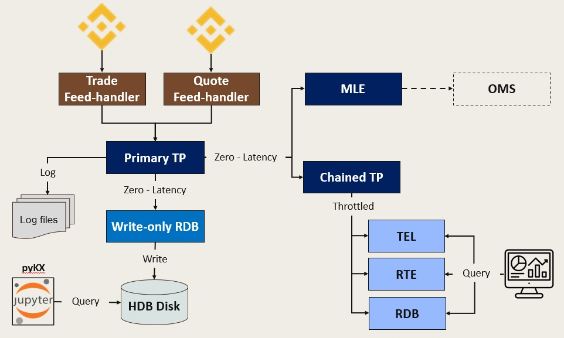

# Tick to Signal

**Real-Time Crypto Analytics and Trading Signals on KDB-X**

This project is a production-grade real-time cryptocurrency analytics system. It ingests live market data from Binance WebSocket streams via C++ feed handlers, and computes analytics in kdb+:

- **VWAP**, **Volatility** and **Order Book Imbalance** from tick data
- **Dollar Imbalance Bars** and **Dollar Runs Bars** for information-driven sampling
- **Position Signals** based on buy/sell pressure analysis

All metrics are delivered to downstream consumers with minimal latency.

The goal is to demonstrate that thoughtful architecture and code quality can achieve production-grade performance without enterprise-scale infrastructure.

## Architecture

The system follows the **KDB-X scaled tick architecture** pattern with clear separation of concerns:

| Layer | Components | Purpose |
|-------|------------|---------|
| **Ingestion** | C++ Feed Handlers | WebSocket → IPC with sub-millisecond latency |
| **Distribution** | Primary TP, Chained TP | Fan-out to consumers, batching for non-critical paths |
| **Storage** | WDB → HDB | Intraday writedown, historical persistence |
| **Analytics** | MLE, RTE | Real-time signal generation and dashboard metrics |
| **Observability** | TEL, RDB | Latency telemetry, ad-hoc queries |

**Key benefits:**
- **Latency isolation**: MLE subscribes tick-by-tick to primary TP for fast signals; RTE/TEL subscribe to batched Chained TP
- **Independent scaling**: Each process can be restarted without affecting others
- **Automatic recovery**: WDB and MLE auto-replay from TP logs on restart
- **Connection resilience**: Exponential backoff throughout the pipeline

## Machine Learning Engine (MLE)

The MLE implements **information-driven bars** from Marcos López de Prado's *Advances in Financial Machine Learning*:

| Bar Type | Trigger | Captures |
|----------|---------|----------|
| **Dollar Imbalance Bars (DIB)** | Net buy/sell dollar pressure exceeds threshold | Informed trading activity |
| **Dollar Runs Bars (DRB)** | Consecutive same-direction flow exceeds threshold | Persistent accumulation/distribution |

**Position signals** are generated when buy dollar percentage crosses thresholds:
- `buyDollarPct > 65%` → Long position
- `buyDollarPct < 35%` → Short position

Thresholds adapt automatically via EWMA to changing market conditions.

## The System in Action

**Feed Handler Monitoring** — Health status and latency metrics for trade and quote ingestion.

**Dataflow Monitoring** — Data volume, system resources, and end-to-end latency breakdown.

**Analytics** — VWAP, Volatility, Order Book Imbalance

## Technology Choices

**C++** for the feed handlers—direct control over memory layout, deterministic performance, and efficient integration with WebSocket libraries and the kdb+ IPC interface. For latency-sensitive ingestion where every microsecond matters, C++ remains the right tool.

**kdb+** for analytics—its vector-oriented execution model and columnar data structures make it exceptionally efficient for the aggregations and windowed calculations that VWAP, volatility, and information-driven bars require.

## Observability by Design

Telemetry is embedded throughout the system. Every event carries nanosecond timestamps at ingestion, microsecond measurements for parsing and IPC, and sequence numbers for gap detection. You cannot optimize what you cannot measure.

## Repository Structure

| Folder | Contents |
|--------|----------|
| [paper/](paper/) | White paper (PDF) |
| [decisions/](decisions/) | Architecture Decision Records |
| [specs/](specs/) | API and data schemas |
| [reference/](reference/) | External references |
| [notes/](notes/) | Implementation notes |

## Exploring with AI

The documentation in this repository is structured for AI-assisted exploration. All architecture decisions, specifications, and implementation notes are written in markdown—making them ideal for use with Large Language Models like Claude.

### Using Claude Projects

To create an AI assistant that understands this system:

1. Go to [claude.ai](https://claude.ai) → **Projects** → **New Project**
2. Create a personal project (Name and describe your project)
3. Fill Instructions
4. Add files from Github
5. Start asking questions

## Code

The implementation lives in a separate repository: [tick-to-signal](https://github.com/PhilSing24/tick-to-signal). The code repository is private. 
If you're interested in the implementation or have questions, feel free to reach out via [LinkedIn](https://www.linkedin.com/in/phdamay) or open an issue in this repository.

## White Paper

**Tick Data to Signals: Real-Time Crypto Analytics on KDB-X**

Draft available at [paper/Real_time_Crypto_KDB.pdf](paper/Real_time_Crypto_KDB.pdf).

## Architecture: Divergences from Reference Patterns

The two tables describe the divergences with the pattern recommendation in Building Real-Time Event-Driven KDB-X Systems (Data Intellect).

### Acknowledged Trade-offs

| Pattern | Reference Recommendation | Project Decision | Rationale |
|---------|-------------------------|------------------|-----------|
| **User isolation** | Separate UI cache layer | Direct queries to RDB/RTE/TEL | Acceptable for single-user development |

### Patterns Not Implemented

| Pattern | Reference Recommendation | Project Status | Impact |
|---------|-------------------------|----------------|--------|
| **FH local recovery log** | Feed handler maintains local log for replay after TP disconnect | Not implemented | Gaps during FH↔TP disconnect are permanent |
| **Replicated feed handlers** | Multiple FH instances for resilience | Single instance | Single point of failure at ingestion boundary |
| **Status propagation** | Pub/sub staleness cascade across components | Validity flags only | Downstream must query validity rather than subscribe |
