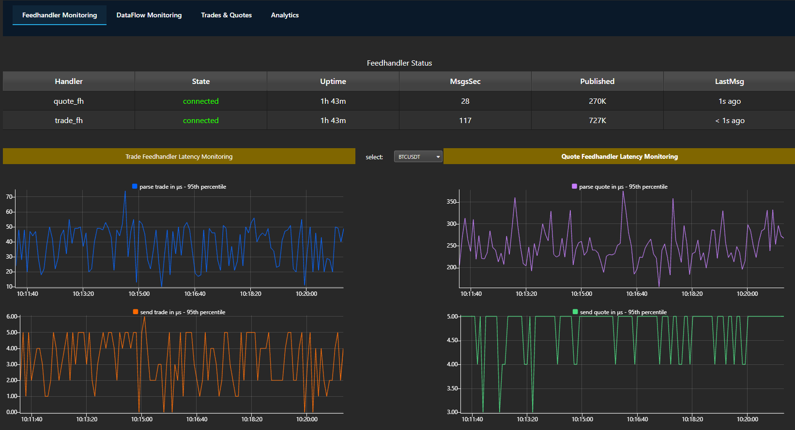
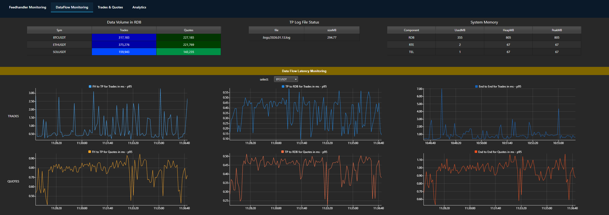
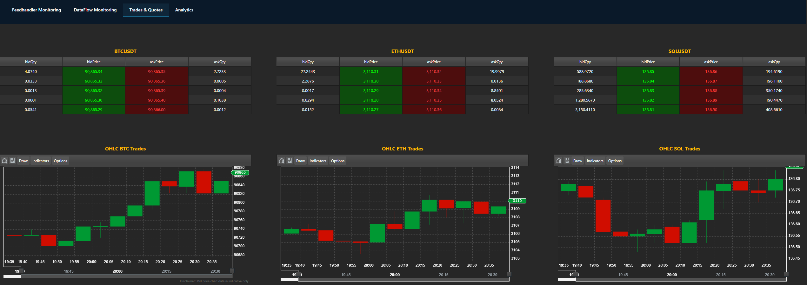
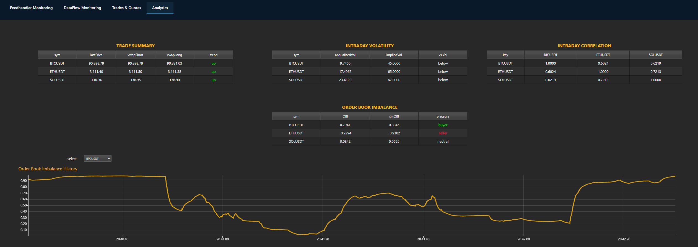

# Tick to Signal

**Real-Time Crypto Analytics on KDB-X**

This project is a production-grade real-time cryptocurrency analytics system. It ingests live market data from Binance WebSocket streams via C++ feed handlers, and computes analytics in kdb+:

- **VWAP**, **Volatility** and **Correlation** from tick data
- **Order book imbalance** from L2 snapshots with 5 levels of depth

All metrics are delivered to downstream consumers with minimal latency.

The goal is to demonstrate that thoughtful architecture and code quality can achieve production-grade performance without enterprise-scale infrastructure.

## The System in Action

**Feed Handler Monitoring** — Health status and latency metrics for trade and quote ingestion.

**Dataflow Monitoring** — Data volume, system resources, and end-to-end latency breakdown.

**Trades and Quotes Monitoring** — Order Book and OHLC 

**Analytics** — VWAP, Volatility, Correlation, Order Book Imbalance

## Technology Choices

**C++** for the feed handlers—direct control over memory layout, deterministic performance, and efficient integration with WebSocket libraries and the kdb+ IPC interface. For latency-sensitive ingestion where every microsecond matters, C++ remains the right tool.

**kdb+** for analytics—its vector-oriented execution model and columnar data structures make it exceptionally efficient for the aggregations and windowed calculations that VWAP and order book imbalance require.

## Observability by Design

Telemetry is embedded throughout the system. Every event carries nanosecond timestamps at ingestion, microsecond measurements for parsing and IPC, and sequence numbers for gap detection. You cannot optimize what you cannot measure.

## Repository Structure

| Folder | Contents |
|--------|----------|
| [paper/](paper/) | White paper (PDF) |
| [decisions/](decisions/) | Architecture Decision Records |
| [specs/](specs/) | API and data schemas |
| [reference/](reference/) | External references |
| [notes/](notes/) | Implementation notes |

## Code

The implementation lives in a separate repository: [tick-to-signal](https://github.com/PhilSing24/tick-to-signal)

## White Paper

**Tick Data to Signals: Real-Time Crypto Analytics on KDB-X**

Draft available at [paper/tick-data-to-signals-v1.0-draft.pdf](paper/tick-data-to-signals-v1.0-draft.pdf).

## Access

The code repository is private. If you're interested in the implementation or have questions, feel free to reach out via [LinkedIn](https://www.linkedin.com/in/phdamay) or open an issue in this repository.
